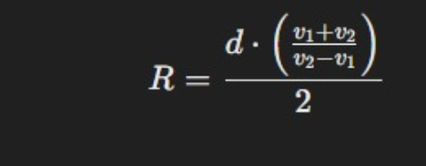
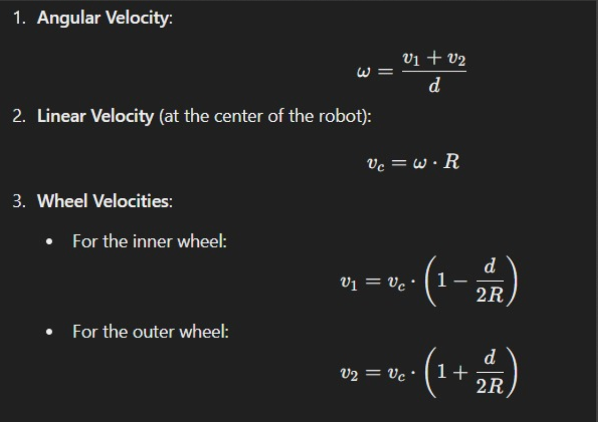

# Table of contents 
# Introduction 
- Downloaded the files [Coppeliasim]("world.ttt") and template
- Compared the contents of template(task) to run.py 
- Simulated the [script](task_1.py) on new world by changing bot name in file 
- Researched on rospy module of python 
- Downloaded rospy on my system 
- used openAI to interpret working of run.py file 
- refered [documentation](https://manual.coppeliarobotics.com/) of coppeliasim and API references 
- learned coppeliasim simulation through python from [Yotube]('https://www.youtube.com/playlist?list=PLc7bpbeTIk77hVBw0QiST8BWxLNJsVbiM')
- gone through basic object API reference like  `sim.getObject`
- learned about Dynamics specifically about  ` sim.setJointTargetVelocity`

# Working 
- added object retrivel command to template
- checked indentation after adding `sim.getObjectfor` robot 
- defined robot as global variable 
- checked naming of left motor and right motor from coppeliasim
- added object retrival coomand for left joint and right joint as `joint_l ` `joint_r`
- used  `sim.setJointTargetVelocity` to set velocity of left joint and right joint 
- started with taking same velocity for right and left joint 
- crn_bot moved in rotational manner
- changed the velocity of both joints but kept positive 
- observed the rotational motion but of one wheel such that other wheel was pivoted (smaller velocity)
- changed the sign of velocity to get circular motion of random radii 

## Simulation 
[Watch the video1](video/1.mp4)
[Watch the video2](video/4.avi)
[Watch the video3](video/6.mp4)
