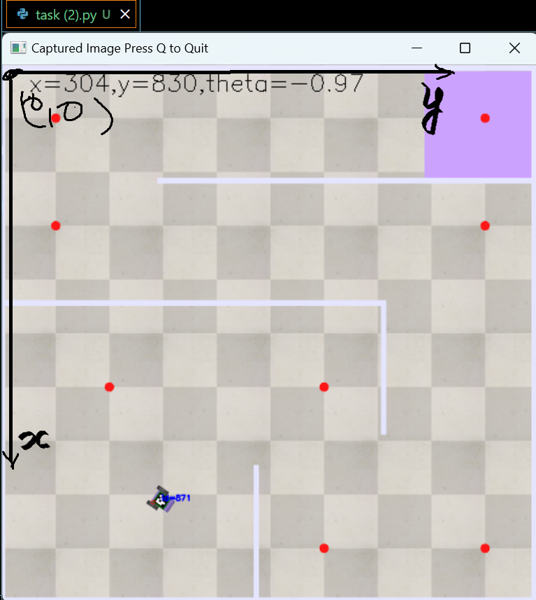

## Milestone_2 
# introduction 
- copied code of milestone_1([file](C:\Users\HP\crn-task\task_1))
- watched [youtube](https://www.youtube.com/watch?v=pNJh83cp1lY) to get idea of vision sensor and its working 
- opened scene to review changes made in the world for milestone_2
- read documentation of aruco marker ([file](https://pyimagesearch.com/2020/12/21/detecting-aruco-markers-with-opencv-and-python/)) to get better understanding of aruco marker and their working.
- watched [youtube](https://www.youtube.com/watch?v=sg1bVJBjbng) and [detection](https://www.youtube.com/watch?v=UlM2bpqo_o0) for getting familair with detection of aruco marker.
- learned that aruco marker provided on bot is `4x4_1000` type aruco marker 
- read [API References](https://manual.coppeliarobotics.com/en/apiFunctions.htm) to know about vision sensors codes and functions 
# Working
- used `sim.getObject` to retieve vision sensor from scene to script.
- used `sim.handlevisionsensor` for handling of vision sensor(didn't work for some reason)
- directly used `sim.getvisionsensorimg` and defined image and resolution(1024x1024)
- got image as image buffer to get arrays from that ,used '[sim.unpackUInt8Table](https://manual.coppeliarobotics.com/en/regularApi/simUnpackUInt8Table.htm)'
- now image to numpy array
- reshaped the image to 1024x1024x3 for 3 color channels
- used youtube to know about aruco marker and its detection
- used predifined dictinory for for aruco markers(4*4_1000)
- there were three 4x4 types of [aruco markers](https://docs.opencv.org/4.x/d5/dae/tutorial_aruco_detection.html)(50,100,1000)
- detected markers and got location of tag's corners 
- calculated geomatric center and oreintation through 'import math'
- used `putText` to add these to image captured learned from [link](https://www.geeksforgeeks.org/python-opencv-cv2-puttext-method/).
- took assitance from openAI to write quit command by  pressing q 
## simulation and refernce lines 
- bot is at 'center: (204, 863)' 'orientation: 3.05 radians' from origin 
- 'image' attached for origin and axis 

- [simulation video](video.mp4)